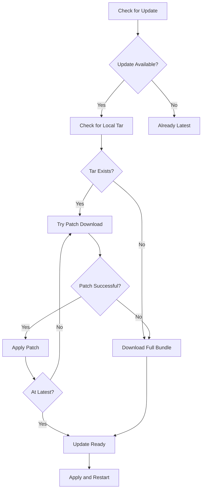

## Overview

Electrobun includes a powerful auto-update system with:

- **Binary patching**: Download only the differences between versions
- **Full downloads**: Fallback to complete bundles when needed
- **Progress tracking**: Real-time update status and progress
- **Cross-platform**: Works on macOS, Windows, and Linux

## How Updates Work



The updater attempts to use binary patches (much smaller) before falling back to full downloads.

## Basic Usage

<Steps>
  <Step title="Import the Updater">
    ```typescript
    import { Updater } from "electrobun/bun";
    ```
  </Step>

  <Step title="Check for updates">
    ```typescript
    const updateInfo = await Updater.checkForUpdate();

    if (updateInfo.updateAvailable) {
      console.log(`Update available: ${updateInfo.version}`);
      console.log(`Current: ${await Updater.localInfo.version()}`);
    }
    ```
  </Step>

  <Step title="Download the update">
    ```typescript
    if (updateInfo.updateAvailable) {
      await Updater.downloadUpdate();
      console.log("Update downloaded and ready");
    }
    ```
  </Step>

  <Step title="Apply the update">
    ```typescript
    if (updateInfo.updateReady) {
      await Updater.applyUpdate();
      // App will restart automatically
    }
    ```
  </Step>
</Steps>

## Update Status Tracking

Monitor update progress with status events:

```typescript
import { Updater } from "electrobun/bun";

// Subscribe to status updates
Updater.onStatusChange((status) => {
  console.log(`[${status.status}] ${status.message}`);
  
  if (status.details?.progress) {
    console.log(`Progress: ${status.details.progress}%`);
  }
});

// Check for updates
await Updater.checkForUpdate();

// Download updates
await Updater.downloadUpdate();
```

### Update Status Types

The updater emits these status events:

```typescript
type UpdateStatus =
  | "idle"
  | "checking"
  | "no-update"
  | "update-available"
  | "downloading"
  | "download-progress"
  | "decompressing"
  | "download-complete"
  | "applying"
  | "complete"
  | "error";
```

### Status Details

Each status includes optional details:

```typescript
interface UpdateStatusDetails {
  currentHash?: string;       // Current version hash
  latestHash?: string;        // Latest version hash
  progress?: number;          // Download progress (0-100)
  bytesDownloaded?: number;   // Bytes downloaded
  totalBytes?: number;        // Total download size
  usedPatchPath?: boolean;    // Whether patches were used
  errorMessage?: string;      // Error details
}
```

## Complete Update UI Example

Here's a full example with progress tracking:

```typescript src/bun/updater.ts
import { Updater, BrowserWindow } from "electrobun/bun";

export async function setupAutoUpdates(mainWindow: BrowserWindow) {
  // Track update status
  Updater.onStatusChange((status) => {
    // Send status to renderer
    mainWindow.webview.rpc.send.updateStatus({
      status: status.status,
      message: status.message,
      progress: status.details?.progress,
    });
  });

  // Check for updates on startup
  console.log("Checking for updates...");
  const updateInfo = await Updater.checkForUpdate();

  if (updateInfo.updateAvailable) {
    console.log(`Update available: ${updateInfo.version}`);
    
    // Ask user if they want to update
    const shouldUpdate = await askUserToUpdate(mainWindow);
    
    if (shouldUpdate) {
      console.log("Downloading update...");
      await Updater.downloadUpdate();
      
      console.log("Update ready, applying...");
      await Updater.applyUpdate();
      // App will restart automatically
    }
  } else {
    console.log("Already on latest version");
  }
}

async function askUserToUpdate(window: BrowserWindow): Promise<boolean> {
  const response = await window.webview.rpc.request.confirmUpdate({
    version: (await Updater.updateInfo()).version,
  });
  return response.confirmed;
}
```

```typescript src/mainview/updater.ts
import Electrobun from "electrobun/view";

// Handle update status from backend
Electrobun.rpc.on.updateStatus(({ status, message, progress }) => {
  const statusEl = document.getElementById("update-status");
  if (!statusEl) return;

  if (status === "download-progress" && progress !== undefined) {
    statusEl.textContent = `Downloading: ${progress}%`;
  } else {
    statusEl.textContent = message;
  }
});

// Respond to update confirmation request
Electrobun.rpc.handle.confirmUpdate(async ({ version }) => {
  const confirmed = confirm(`Update to version ${version}?`);
  return { confirmed };
});
```

## Binary Patching

Electrobun uses binary patching to minimize download sizes:

- **Patch files**: Only contain the differences between versions
- **Patch chain**: Can apply multiple patches sequentially
- **Fallback**: Downloads full bundle if patches aren't available

### How Patching Works

1. Check if local `.tar` file exists for current version
2. Download patch file for current version (e.g., `{hash}.patch`)
3. Apply patch using `bspatch` to create next version
4. Repeat until reaching latest version
5. If any step fails, download full bundle

### Patch Status Events

```typescript
Updater.onStatusChange((status) => {
  switch (status.status) {
    case "local-tar-found":
      console.log("Found local version, trying patches");
      break;
    case "patch-found":
      console.log(`Downloading patch ${status.details?.patchNumber}`);
      break;
    case "patch-applied":
      console.log(`Applied ${status.details?.totalPatchesApplied} patches`);
      break;
    case "downloading-full-bundle":
      console.log("Patches failed, downloading full version");
      break;
  }
});
```

## Local Info

Access information about the current app version:

```typescript
import { Updater } from "electrobun/bun";

// Get current version info
const version = await Updater.localInfo.version();
const hash = await Updater.localInfo.hash();
const channel = await Updater.localInfo.channel();
const baseUrl = await Updater.localInfo.baseUrl();

console.log(`Running version ${version} (${hash})`);
console.log(`Channel: ${channel}`);
```

## Update Info

Get information about available updates:

```typescript
const updateInfo = await Updater.checkForUpdate();

console.log(updateInfo);
// {
//   version: "1.2.0",
//   hash: "abc123...",
//   updateAvailable: true,
//   updateReady: false,
//   error: ""
// }
```

## Status History

Review the complete update history:

```typescript
// Get all status events
const history = Updater.getStatusHistory();

history.forEach((entry) => {
  console.log(`[${entry.timestamp}] ${entry.status}: ${entry.message}`);
});

// Clear history
Updater.clearStatusHistory();
```

## Dev Channel Behavior

Updates are disabled in development mode:

```typescript
const info = await Updater.checkForUpdate();

if (info.channel === "dev") {
  console.log("Updates disabled in dev mode");
}
```

<Note>
To test updates, build your app with `--channel canary` or `--channel production`.
</Note>

## Error Handling

Handle update errors gracefully:

```typescript
try {
  await Updater.downloadUpdate();
  
  const info = Updater.updateInfo();
  if (info.error) {
    console.error("Update failed:", info.error);
  }
} catch (error) {
  console.error("Update error:", error);
}

// Or monitor via status
Updater.onStatusChange((status) => {
  if (status.status === "error") {
    console.error("Update error:", status.details?.errorMessage);
  }
});
```

## Platform Differences

<Tabs>
  <Tab title="macOS">
    - Updates replace the entire `.app` bundle
    - Quarantine attributes are automatically removed
    - App restarts using `open` command
  </Tab>

  <Tab title="Windows">
    - Uses a batch script to replace files after exit
    - Scheduled task runs the update script
    - App restarts via `launcher.exe`
  </Tab>

  <Tab title="Linux">
    - Updates the app directory bundle
    - Sets executable permissions on binaries
    - App restarts using the launcher binary
  </Tab>
</Tabs>

## Update Server Setup

Your update server should serve:

1. **Update info**: `{prefix}-update.json`
   ```json
   {
     "version": "1.2.0",
     "hash": "abc123...",
     "updateAvailable": true
   }
   ```

2. **Full bundles**: `{prefix}-{appname}.tar.zst`
3. **Patch files**: `{prefix}-{fromHash}.patch`

Where `{prefix}` is: `{channel}-{platform}-{arch}` (e.g., `canary-macos-arm64`).

## Best Practices

<AccordionGroup>
  <Accordion title="Check for updates on startup">
    Run update checks when the app starts:

    ```typescript
    await setupAutoUpdates(mainWindow);
    ```
  </Accordion>

  <Accordion title="Show progress to users">
    Display update progress in the UI:

    ```typescript
    Updater.onStatusChange((status) => {
      updateUI(status);
    });
    ```
  </Accordion>

  <Accordion title="Handle errors gracefully">
    Don't crash if updates fail:

    ```typescript
    try {
      await Updater.downloadUpdate();
    } catch (error) {
      console.error("Update failed, continuing with current version");
    }
    ```
  </Accordion>

  <Accordion title="Let users defer updates">
    Give users control over when to update:

    ```typescript
    if (updateInfo.updateAvailable) {
      const install = await askUser();
      if (install) {
        await Updater.downloadUpdate();
        await Updater.applyUpdate();
      }
    }
    ```
  </Accordion>
</AccordionGroup>

## Next Steps

<CardGroup cols={2}>
  <Card title="Building & Distributing" icon="box" href="/distribution/packaging">
    Learn how to build and package your app
  </Card>
  <Card title="Native Integrations" icon="laptop-code" href="/guides/native-integrations">
    Use system notifications and dialogs
  </Card>
</CardGroup>