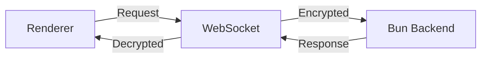

## Overview

Electrobun uses a type-safe RPC (Remote Procedure Call) system for communication between the Bun backend and renderer views. RPC enables:

- **Requests**: Two-way communication with responses
- **Messages**: One-way notifications
- **Type safety**: Full TypeScript type inference
- **Encryption**: Automatic AES-256-GCM encryption over WebSockets

## How RPC Works



RPC uses WebSockets for fast, bidirectional communication with automatic encryption.

## Defining RPC Schemas

<Steps>
  <Step title="Define your RPC schema">
    Create a shared RPC definition:

    ```typescript src/bun/rpc.ts
    import { BrowserView } from "electrobun/bun";

    export const rpc = BrowserView.defineRPC<{
      // Requests: expect responses
      requests: {
        greet: { name: string } => Promise<{ message: string }>;
        calculate: { a: number; b: number } => Promise<{ result: number }>;
      };
      // Messages: one-way notifications
      messages: {
        notify: { text: string } => void;
        updateProgress: { percent: number } => void;
      };
    }>({
      maxRequestTime: 10000,  // 10 second timeout
      handlers: {
        requests: {
          greet: async ({ name }) => {
            return { message: `Hello, ${name}!` };
          },
          calculate: async ({ a, b }) => {
            return { result: a + b };
          },
        },
        messages: {
          notify: ({ text }) => {
            console.log("Notification:", text);
          },
          updateProgress: ({ percent }) => {
            console.log(`Progress: ${percent}%`);
          },
        },
      },
    });
    ```
  </Step>

  <Step title="Attach RPC to a window">
    Pass the RPC instance when creating a window:

    ```typescript src/bun/index.ts
    import { BrowserWindow } from "electrobun/bun";
    import { rpc } from "./rpc";

    const mainWindow = new BrowserWindow({
      title: "My App",
      url: "views://mainview/index.html",
      rpc,  // Attach RPC handlers
    });
    ```
  </Step>

  <Step title="Set up renderer-side RPC">
    Create the RPC client in your renderer:

    ```typescript src/mainview/index.ts
    import Electrobun, { Electroview } from "electrobun/view";

    const rpc = Electroview.defineRPC<{
      requests: {
        getData: {} => Promise<{ data: string }>;
      };
      messages: {
        statusUpdate: { status: string } => void;
      };
    }>({
      handlers: {
        requests: {
          getData: async () => {
            return { data: "Some data" };
          },
        },
        messages: {
          statusUpdate: ({ status }) => {
            console.log("Status:", status);
          },
        },
      },
    });

    // Initialize Electrobun with RPC
    const electrobun = new Electrobun.Electroview({ rpc });
    ```
  </Step>
</Steps>

## Making RPC Requests

### From Bun to Renderer

```typescript src/bun/index.ts
import { BrowserWindow } from "electrobun/bun";
import { rpc } from "./rpc";

const mainWindow = new BrowserWindow({
  url: "views://mainview/index.html",
  rpc,
});

// Make a request
const response = await mainWindow.webview.rpc.request.getData({});
console.log(response.data);

// Send a message (no response)
mainWindow.webview.rpc.send.statusUpdate({ status: "Loading..." });
```

### From Renderer to Bun

```typescript src/mainview/index.ts
import Electrobun from "electrobun/view";

// Make a request
const result = await Electrobun.rpc.request.greet({ name: "Alice" });
console.log(result.message);  // "Hello, Alice!"

// Send a message
Electrobun.rpc.send.notify({ text: "Button clicked" });
```

## Request vs Message

<Tabs>
  <Tab title="Requests">
    **Requests** wait for a response:

    ```typescript
    // Backend handler
    requests: {
      fetchUser: async ({ userId }) => {
        const user = await db.getUser(userId);
        return { user };
      },
    }

    // Frontend call
    const { user } = await Electrobun.rpc.request.fetchUser({ userId: 123 });
    ```

    Use requests when you need a response or confirmation.
  </Tab>

  <Tab title="Messages">
    **Messages** are fire-and-forget:

    ```typescript
    // Backend handler
    messages: {
      logEvent: ({ event, data }) => {
        logger.info(event, data);
        // No return value
      },
    }

    // Frontend call
    Electrobun.rpc.send.logEvent({ event: "click", data: {} });
    ```

    Use messages for events, notifications, or when you don't need a response.
  </Tab>
</Tabs>

## Complete Example

Here's a full example with bidirectional RPC:

<CodeGroup>
```typescript src/bun/index.ts
import { BrowserWindow, BrowserView } from "electrobun/bun";

type RPCSchema = {
  requests: {
    getConfig: {} => Promise<{ theme: string; lang: string }>;
    saveFile: { path: string; content: string } => Promise<{ success: boolean }>;
  };
  messages: {
    notify: { message: string } => void;
  };
};

const rpc = BrowserView.defineRPC<RPCSchema>({
  maxRequestTime: 5000,
  handlers: {
    requests: {
      getConfig: async () => {
        return { theme: "dark", lang: "en" };
      },
      saveFile: async ({ path, content }) => {
        await Bun.write(path, content);
        return { success: true };
      },
    },
    messages: {
      notify: ({ message }) => {
        console.log("Notification from renderer:", message);
      },
    },
  },
});

const mainWindow = new BrowserWindow({
  title: "RPC Demo",
  url: "views://mainview/index.html",
  rpc,
});

// Send message to renderer
setTimeout(() => {
  mainWindow.webview.rpc.send.dataUpdate({ data: "New data" });
}, 3000);
```

```typescript src/mainview/index.ts
import Electrobun, { Electroview } from "electrobun/view";

const rpc = Electroview.defineRPC<{
  requests: {
    getData: {} => Promise<{ items: string[] }>;
  };
  messages: {
    dataUpdate: { data: string } => void;
  };
}>({
  handlers: {
    requests: {
      getData: async () => {
        return { items: ["Item 1", "Item 2"] };
      },
    },
    messages: {
      dataUpdate: ({ data }) => {
        console.log("Data updated:", data);
        document.body.innerHTML = `<p>Update: ${data}</p>`;
      },
    },
  },
});

const electrobun = new Electrobun.Electroview({ rpc });

// Make request to backend
const config = await Electrobun.rpc.request.getConfig({});
console.log("Config:", config);

// Send message to backend
Electrobun.rpc.send.notify({ message: "Page loaded" });

// Save file example
document.getElementById("save")?.addEventListener("click", async () => {
  const result = await Electrobun.rpc.request.saveFile({
    path: "./output.txt",
    content: "Hello World",
  });
  
  if (result.success) {
    console.log("File saved!");
  }
});
```
</CodeGroup>

## Wildcard Message Handlers

Catch all messages with a wildcard handler:

```typescript
const rpc = BrowserView.defineRPC({
  handlers: {
    messages: {
      "*": (messageName, payload) => {
        console.log(`Received ${String(messageName)}:`, payload);
      },
    },
  },
});
```

## Error Handling

Handle RPC errors gracefully:

```typescript
try {
  const result = await Electrobun.rpc.request.riskyOperation({ id: 123 });
  console.log(result);
} catch (error) {
  console.error("RPC request failed:", error);
  // Handle timeout, network error, or handler exception
}
```

## Timeout Configuration

Set custom timeouts for RPC requests:

```typescript
const rpc = BrowserView.defineRPC({
  maxRequestTime: 30000,  // 30 seconds for slow operations
  handlers: {
    requests: {
      longOperation: async () => {
        await someSlowTask();
        return { done: true };
      },
    },
  },
});
```

## Security Considerations

<Warning>
**Sandbox mode disables RPC entirely.** If you enable `sandbox: true` on a window or view, RPC will not work.
</Warning>

```typescript
// RPC disabled for security
const untrustedWindow = new BrowserWindow({
  url: "https://external-site.com",
  sandbox: true,  // No RPC access
});
```

## Transport Details

Electrobun's RPC uses:

- **WebSockets** for fast bidirectional communication
- **AES-256-GCM encryption** with per-view secret keys
- **Automatic reconnection** if the socket drops
- **Fallback to executeJavascript** if WebSocket is unavailable

## Type Safety

RPC provides full type inference:

```typescript
// TypeScript knows the exact shape
const result = await Electrobun.rpc.request.getUser({ id: 1 });
//    ^? { user: { name: string; email: string } }

// Compile error on wrong params
Electrobun.rpc.request.getUser({ wrong: "params" });
//                               ^^^ Error: Object literal may only specify known properties
```

## Best Practices

<AccordionGroup>
  <Accordion title="Use TypeScript for type safety">
    Define your RPC schema with TypeScript for compile-time type checking and autocomplete.
  </Accordion>

  <Accordion title="Keep handlers fast">
    RPC handlers should complete quickly. For long-running tasks, use messages to send progress updates:

    ```typescript
    requests: {
      startExport: async () => {
        exportData((progress) => {
          // Send progress updates
          mainWindow.webview.rpc.send.exportProgress({ percent: progress });
        });
        return { started: true };
      },
    }
    ```
  </Accordion>

  <Accordion title="Validate input data">
    Always validate data from RPC calls:

    ```typescript
    requests: {
      updateUser: async ({ userId, name }) => {
        if (!userId || !name) {
          throw new Error("Invalid input");
        }
        // Safe to proceed
      },
    }
    ```
  </Accordion>

  <Accordion title="Use messages for events">
    Prefer messages over requests when you don't need a response:

    ```typescript
    // Good: fire-and-forget
    Electrobun.rpc.send.logClick({ button: "save" });

    // Bad: unnecessary request
    await Electrobun.rpc.request.logClick({ button: "save" });
    ```
  </Accordion>
</AccordionGroup>

## Next Steps

<CardGroup cols={2}>
  <Card title="Creating Windows" icon="window" href="/guides/creating-windows">
    Learn how to create windows with RPC
  </Card>
  <Card title="Working with Views" icon="layer-group" href="/guides/working-with-views">
    Manage multiple views with RPC
  </Card>
</CardGroup>